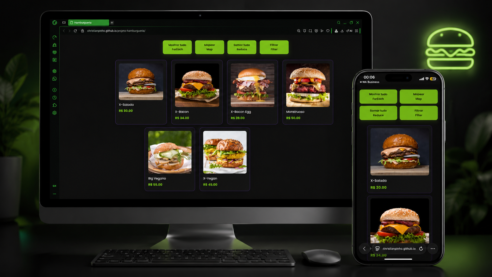

# Projeto Hamburgueria

Projeto desenvolvido para praticar JavaScript, manipulando uma lista de produtos de uma hamburgueria com os métodos `forEach`, `map`, `reduce` e `filter`.

## Acesse o projeto

[Ver projeto online](https://christianpinho.github.io/projeto-hamburgueria/)

## Funcionalidades

- Mostrar todos os produtos do cardápio
- Aplicar 10% de desconto em todos os produtos
- Somar o valor total dos produtos
- Filtrar apenas os produtos veganos
- Layout responsivo para celular

## Tecnologias utilizadas

- HTML
- CSS
- JavaScript

## Aprendizados

Neste projeto pratiquei:

- Manipulação do DOM
- Eventos de clique com `addEventListener`
- Renderização de elementos na tela com JavaScript
- Uso de `forEach`
- Uso de `map`
- Uso de `reduce`
- Uso de `filter`
- Responsividade com CSS

